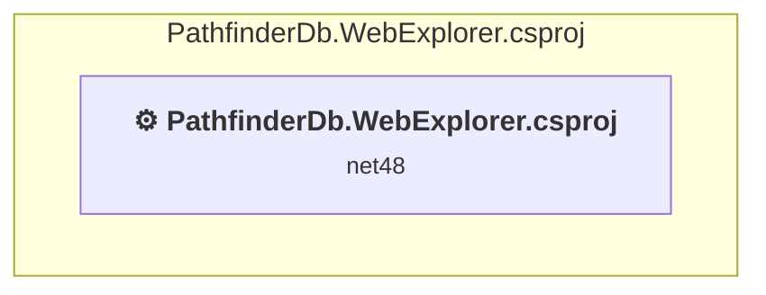

# Projects and dependencies analysis

This document provides a comprehensive overview of the projects and their dependencies in the context of upgrading to .NETCoreApp,Version=v10.0.

## Table of Contents

- [Executive Summary](#executive-Summary)
  - [Highlevel Metrics](#highlevel-metrics)
  - [Projects Compatibility](#projects-compatibility)
  - [Package Compatibility](#package-compatibility)
  - [API Compatibility](#api-compatibility)
  - [Binding Redirect Configuration](#binding-redirect-configuration)
- [Aggregate NuGet packages details](#aggregate-nuget-packages-details)
- [Top API Migration Challenges](#top-api-migration-challenges)
  - [Technologies and Features](#technologies-and-features)
  - [Most Frequent API Issues](#most-frequent-api-issues)
- [Projects Relationship Graph](#projects-relationship-graph)
- [Project Details](#project-details)

  - [src\PathfinderDb.WebExplorer\PathfinderDb.WebExplorer.csproj](#srcpathfinderdbwebexplorerpathfinderdbwebexplorercsproj)

## Executive Summary

### Highlevel Metrics

| Metric | Count | Status |
| :--- | :---: | :--- |
| Total Projects | 1 | All require upgrade |
| Total NuGet Packages | 12 | 5 need upgrade |
| Total Code Files | 36 |  |
| Total Code Files with Incidents | 14 |  |
| Total Lines of Code | 1611 |  |
| Total Number of Issues | 100 |  |
| Estimated LOC to modify | 80+ | at least 5,0% of codebase |

### Projects Compatibility

| Project | Target Framework | Difficulty | Package Issues | API Issues | Binding Issues | Est. LOC Impact | Description |
| :--- | :---: | :---: | :---: | :---: | :---: | :---: | :--- |
| [src\PathfinderDb.WebExplorer\PathfinderDb.WebExplorer.csproj](#srcpathfinderdbwebexplorerpathfinderdbwebexplorercsproj) | net48 | 🔴 High | 13 | 80 | 0 | 80+ | Wap, Sdk Style = False |

### Package Compatibility

| Status | Count | Percentage |
| :--- | :---: | :---: |
| ✅ Compatible | 7 | 58,3% |
| ⚠️ Incompatible | 4 | 33,3% |
| 🔄 Upgrade Recommended | 1 | 8,3% |
| ***Total NuGet Packages*** | ***12*** | ***100%*** |

### API Compatibility

| Category | Count | Impact |
| :--- | :---: | :--- |
| 🔴 Binary Incompatible | 74 | High - Require code changes |
| 🟡 Source Incompatible | 6 | Medium - Needs re-compilation and potential conflicting API error fixing |
| 🔵 Behavioral change | 0 | Low - Behavioral changes that may require testing at runtime |
| ✅ Compatible | 1450 |  |
| ***Total APIs Analyzed*** | ***1530*** |  |

## Aggregate NuGet packages details

| Package | Current Version | Suggested Version | Projects | Description |
| :--- | :---: | :---: | :--- | :--- |
| Microsoft.AspNet.Mvc | 4.0.20710.0 |  | [PathfinderDb.WebExplorer.csproj](#srcpathfinderdbwebexplorerpathfinderdbwebexplorercsproj) | NuGet package functionality is included with framework reference |
| Microsoft.AspNet.Razor | 2.0.20710.0 |  | [PathfinderDb.WebExplorer.csproj](#srcpathfinderdbwebexplorerpathfinderdbwebexplorercsproj) | NuGet package functionality is included with framework reference |
| Microsoft.AspNet.WebApi | 4.0.20710.0 |  | [PathfinderDb.WebExplorer.csproj](#srcpathfinderdbwebexplorerpathfinderdbwebexplorercsproj) | NuGet package functionality is included with framework reference |
| Microsoft.AspNet.WebApi.Client | 4.0.20710.0 | 6.0.0 | [PathfinderDb.WebExplorer.csproj](#srcpathfinderdbwebexplorerpathfinderdbwebexplorercsproj) | ⚠️NuGet package is incompatible |
| Microsoft.AspNet.WebApi.Core | 4.0.20710.0 |  | [PathfinderDb.WebExplorer.csproj](#srcpathfinderdbwebexplorerpathfinderdbwebexplorercsproj) | ⚠️NuGet package is incompatible |
| Microsoft.AspNet.WebApi.WebHost | 4.0.20710.0 |  | [PathfinderDb.WebExplorer.csproj](#srcpathfinderdbwebexplorerpathfinderdbwebexplorercsproj) | ⚠️NuGet package is incompatible |
| Microsoft.AspNet.WebPages | 2.0.20710.0 |  | [PathfinderDb.WebExplorer.csproj](#srcpathfinderdbwebexplorerpathfinderdbwebexplorercsproj) | NuGet package functionality is included with framework reference |
| Microsoft.Net.Http | 2.0.20710.0 |  | [PathfinderDb.WebExplorer.csproj](#srcpathfinderdbwebexplorerpathfinderdbwebexplorercsproj) | Needs to be replaced with Replace with new package System.Net.Http=4.3.4 |
| Microsoft.Web.Infrastructure | 1.0.0.0 |  | [PathfinderDb.WebExplorer.csproj](#srcpathfinderdbwebexplorerpathfinderdbwebexplorercsproj) | NuGet package functionality is included with framework reference |
| Newtonsoft.Json | 4.5.10 | 13.0.4 | [PathfinderDb.WebExplorer.csproj](#srcpathfinderdbwebexplorerpathfinderdbwebexplorercsproj) | NuGet package upgrade is recommended |
| PathfinderDb.Schema | 1.0.1 |  | [PathfinderDb.WebExplorer.csproj](#srcpathfinderdbwebexplorerpathfinderdbwebexplorercsproj) | ⚠️NuGet package is incompatible |
| Twitter.Bootstrap | 2.1.1 |  | [PathfinderDb.WebExplorer.csproj](#srcpathfinderdbwebexplorerpathfinderdbwebexplorercsproj) | ✅Compatible |

## Top API Migration Challenges

### Technologies and Features

| Technology | Issues | Percentage | Migration Path |
| :--- | :---: | :---: | :--- |
| ASP.NET Framework (System.Web) | 79 | 98,8% | Legacy ASP.NET Framework APIs for web applications (System.Web.*) that don't exist in ASP.NET Core due to architectural differences. ASP.NET Core represents a complete redesign of the web framework. Migrate to ASP.NET Core equivalents or consider System.Web.Adapters package for compatibility. |

### Most Frequent API Issues

| API | Count | Percentage | Category |
| :--- | :---: | :---: | :--- |
| M:System.Web.Routing.RouteValueDictionary.Add(System.String,System.Object) | 10 | 12,5% | Binary Incompatible |
| T:System.Web.Routing.RouteValueDictionary | 5 | 6,3% | Binary Incompatible |
| T:System.Web.Mvc.Controller | 4 | 5,0% | Binary Incompatible |
| T:System.Web.Mvc.ActionResult | 3 | 3,8% | Binary Incompatible |
| T:System.Web.Mvc.ViewResult | 3 | 3,8% | Binary Incompatible |
| M:System.Web.Mvc.Controller.#ctor | 3 | 3,8% | Binary Incompatible |
| T:System.Web.Mvc.UrlParameter | 3 | 3,8% | Binary Incompatible |
| T:System.Web.Http.RouteParameter | 3 | 3,8% | Binary Incompatible |
| M:System.Web.Mvc.Controller.View(System.Object) | 2 | 2,5% | Binary Incompatible |
| T:System.Web.HttpServerUtilityBase | 2 | 2,5% | Source Incompatible |
| T:System.Web.WebPages.HelperResult | 2 | 2,5% | Binary Incompatible |
| M:System.Web.Routing.RouteValueDictionary.#ctor | 2 | 2,5% | Binary Incompatible |
| T:System.Web.Routing.RouteCollection | 2 | 2,5% | Binary Incompatible |
| T:System.Web.Mvc.RouteCollectionExtensions | 2 | 2,5% | Binary Incompatible |
| T:System.Web.Http.HttpConfiguration | 2 | 2,5% | Binary Incompatible |
| T:System.Web.Mvc.GlobalFilterCollection | 2 | 2,5% | Binary Incompatible |
| P:System.Web.Mvc.Controller.Server | 1 | 1,3% | Binary Incompatible |
| M:System.Web.Mvc.Controller.View | 1 | 1,3% | Binary Incompatible |
| T:System.Web.Mvc.MvcHtmlString | 1 | 1,3% | Binary Incompatible |
| M:System.Web.HtmlString.ToString | 1 | 1,3% | Source Incompatible |
| M:System.Web.WebPages.HelperResult.#ctor(System.Action{System.IO.TextWriter}) | 1 | 1,3% | Binary Incompatible |
| M:System.ComponentModel.DefaultValueAttribute.#ctor(System.Type,System.String) | 1 | 1,3% | Binary Incompatible |
| M:System.Web.HttpServerUtilityBase.MapPath(System.String) | 1 | 1,3% | Source Incompatible |
| F:System.Web.Mvc.UrlParameter.Optional | 1 | 1,3% | Binary Incompatible |
| T:System.Web.Routing.Route | 1 | 1,3% | Binary Incompatible |
| M:System.Web.Mvc.RouteCollectionExtensions.MapRoute(System.Web.Routing.RouteCollection,System.String,System.String,System.Object) | 1 | 1,3% | Binary Incompatible |
| M:System.Web.Mvc.RouteCollectionExtensions.IgnoreRoute(System.Web.Routing.RouteCollection,System.String) | 1 | 1,3% | Binary Incompatible |
| F:System.Web.Http.RouteParameter.Optional | 1 | 1,3% | Binary Incompatible |
| T:System.Web.Http.HttpRouteCollection | 1 | 1,3% | Binary Incompatible |
| P:System.Web.Http.HttpConfiguration.Routes | 1 | 1,3% | Binary Incompatible |
| T:System.Web.Http.HttpRouteCollectionExtensions | 1 | 1,3% | Binary Incompatible |
| T:System.Web.Http.Routing.IHttpRoute | 1 | 1,3% | Binary Incompatible |
| M:System.Web.Http.HttpRouteCollectionExtensions.MapHttpRoute(System.Web.Http.HttpRouteCollection,System.String,System.String,System.Object) | 1 | 1,3% | Binary Incompatible |
| T:System.Web.Mvc.HandleErrorAttribute | 1 | 1,3% | Binary Incompatible |
| M:System.Web.Mvc.HandleErrorAttribute.#ctor | 1 | 1,3% | Binary Incompatible |
| M:System.Web.Mvc.GlobalFilterCollection.Add(System.Object) | 1 | 1,3% | Binary Incompatible |
| T:System.Web.Routing.RouteTable | 1 | 1,3% | Binary Incompatible |
| P:System.Web.Routing.RouteTable.Routes | 1 | 1,3% | Binary Incompatible |
| T:System.Web.Mvc.GlobalFilters | 1 | 1,3% | Binary Incompatible |
| P:System.Web.Mvc.GlobalFilters.Filters | 1 | 1,3% | Binary Incompatible |
| T:System.Web.Http.GlobalConfiguration | 1 | 1,3% | Binary Incompatible |
| P:System.Web.Http.GlobalConfiguration.Configuration | 1 | 1,3% | Binary Incompatible |
| T:System.Web.Mvc.AreaRegistration | 1 | 1,3% | Binary Incompatible |
| M:System.Web.Mvc.AreaRegistration.RegisterAllAreas | 1 | 1,3% | Binary Incompatible |
| M:System.Web.HttpApplication.#ctor | 1 | 1,3% | Source Incompatible |
| T:System.Web.HttpApplication | 1 | 1,3% | Source Incompatible |

## Projects Relationship Graph

Legend:
📦 SDK-style project
⚙️ Classic project

## Project Details

### src\PathfinderDb.WebExplorer\PathfinderDb.WebExplorer.csproj

#### Project Info

- **Current Target Framework:** net48
- **Proposed Target Framework:** net10.0
- **SDK-style**: False
- **Project Kind:** Wap
- **Dependencies**: 0
- **Dependants**: 0
- **Number of Files**: 60
- **Number of Files with Incidents**: 14
- **Lines of Code**: 1611
- **Estimated LOC to modify**: 80+ (at least 5,0% of the project)

#### Dependency Graph

Legend:
📦 SDK-style project
⚙️ Classic project

### API Compatibility

| Category | Count | Impact |
| :--- | :---: | :--- |
| 🔴 Binary Incompatible | 74 | High - Require code changes |
| 🟡 Source Incompatible | 6 | Medium - Needs re-compilation and potential conflicting API error fixing |
| 🔵 Behavioral change | 0 | Low - Behavioral changes that may require testing at runtime |
| ✅ Compatible | 1450 |  |
| ***Total APIs Analyzed*** | ***1530*** |  |

#### Project Technologies and Features

| Technology | Issues | Percentage | Migration Path |
| :--- | :---: | :---: | :--- |
| ASP.NET Framework (System.Web) | 79 | 98,8% | Legacy ASP.NET Framework APIs for web applications (System.Web.*) that don't exist in ASP.NET Core due to architectural differences. ASP.NET Core represents a complete redesign of the web framework. Migrate to ASP.NET Core equivalents or consider System.Web.Adapters package for compatibility. |

